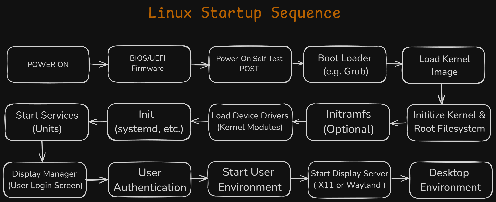

# Linux Startup Sequence

**Last Updated:** 2025-07-15

The Linux startup sequence is the process that occurs when a Linux system is powered on. It is a complex process that involves a number of different components, including the BIOS, the bootloader, the kernel, and the init system.

## The Startup Sequence

1.  **BIOS:** The BIOS (Basic Input/Output System) is the first software that is executed when the system is powered on. The BIOS is responsible for initializing the hardware and loading the bootloader.
2.  **Bootloader:** The bootloader is a program that is responsible for loading the kernel. The most common bootloader for Linux is GRUB (GRand Unified Bootloader).
3.  **Kernel:** The kernel is the core of the Linux operating system. It is responsible for managing the system's resources and providing a platform for running applications.
4.  **Init System:** The init system is the first process that is started by the kernel. It is responsible for starting all of the other processes on the system. The most common init system for Linux is systemd.

## The Boot Process in Detail

1.  **Power On:** The user powers on the system.
2.  **BIOS:** The BIOS performs a Power-On Self-Test (POST) to check that all of the hardware is working correctly. The BIOS then loads the bootloader from the Master Boot Record (MBR) or the GUID Partition Table (GPT).
3.  **Bootloader:** The bootloader loads the kernel and the initramfs into memory. The bootloader then passes control to the kernel.
4.  **Kernel:** The kernel initializes the hardware and mounts the root file system. The kernel then starts the init system.
5.  **Init System:** The init system starts all of the other processes on the system, such as the display manager, the network manager, and the login manager.
6.  **Login:** The user is prompted to log in. Once the user has logged in, the desktop environment is started.